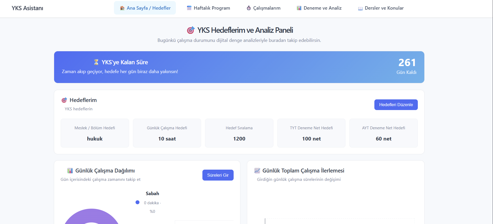
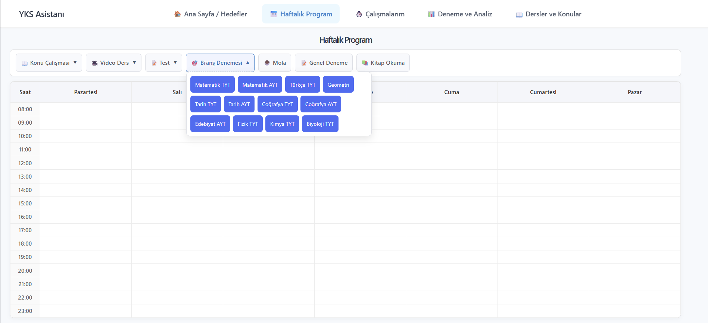
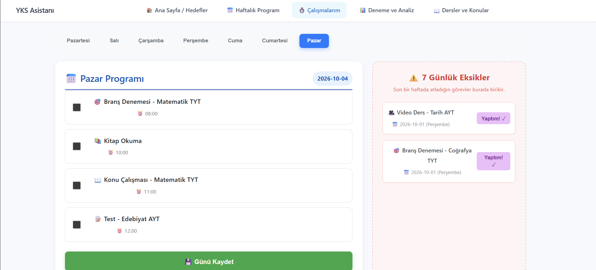
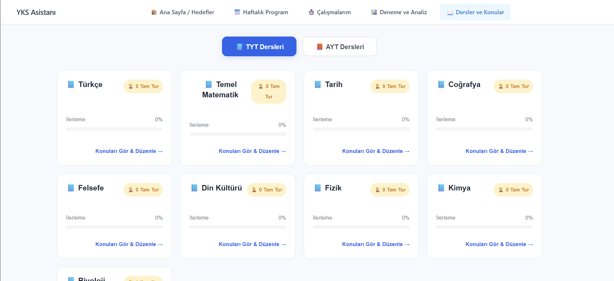

# 🎯 YKS Asistanı (YKS Study & Tracking Application)

<div align="center">


YKS hazırlık sürecini dijital ortamda profesyonelce planlamak, ders ve konu bazlı ilerlemeleri yönetmek, hedef takibi yapmak ve günlük çalışma / eksik takibi oluşturmak için geliştirilmiş kapsamlı bir web uygulamasıdır.

</div>

---

## 🌟 Öne Çıkan Özellikler

* **📊 Dinamik Hedefler ve Geri Sayım:** Sınava kalan gün sayısını anlık takip edin; meslek hedefi, günlük çalışma saati, hedef sıralama ve TYT/AYT net hedeflerinizi belirleyin.
* **📅 İnteraktif Haftalık Program:** Saatlik ve gün bazlı planlama yapın; *Konu Çalışması, Video Ders, Test, Branş Denemesi, Mola, Genel Deneme* ve *Kitap Okuma* gibi etkinlikleri kolayca organize edin.
* **⏱️ Çalışmalarım & Eksik Takibi:** Günlük programları günün sonunda kaydedin; geçmiş 7 günde atlanan/yapılmayan görevleri sağ panelde görerek "Yaptım! ✓" butonuyla kolayca telafi edin.
* **📚 Kapsamlı Ders & Konu Yönetimi:** TYT ve AYT kategorilerinde toplam 21 ders ve 295+ konuyu yönetin. Anlık arama çubuğu ile konuları filtreleyin.
* **🏆 Tam Tur (Round) Sistemi:** Bir dersin tüm konuları bittiğinde "Tam Tur" sayısının otomatik artmasını sağlayın ya da dilediğiniz zaman manuel olarak yönetin.

## 📸 Ekran Görüntüleri ve Arayüz

### 🏠 Ana Sayfa & Hedefler


### 📅 Haftalık Program Planlayıcı


### ⏱️ Çalışmalarım & Eksik Takibi


### 📚 Dersler ve Konular Yönetimi


## 🛠️ Kullanılan Teknolojiler ve Mimari

### 🚀 Backend
* **Python & FastAPI**: Yüksek performanslı, modern ve async destekli RESTful API mimarisi.
* **SQLAlchemy (ORM)**: Veritabanı tabloları ve ilişkilerinin Nesne Yönelimli Programlama ile yönetimi.
* **Pydantic**: Veri doğrulama ve şema yönetimi.

### 💻 Frontend
* **React (Vite)**: Modüler, hızlı ve modern bileşen tabanlı arayüz.
* **Axios**: Backend ile asenkron HTTP haberleşmesi.
* **CSS3**: Özel tasarım kartlar, modern gölgelendirmeler ve responsive düzen.

### 🗄 Veritabanı & Altyapı
* **PostgreSQL**: Güvenli, ilişkisel ve güçlü veri saklama altyapısı.
* **Docker & Docker Compose**: Veritabanının konteyner üzerinde izole ve hatasız çalıştırılması.
* **Git & GitHub**: Profesyonel versiyon kontrolü ve güvenlik yönetimi.

---

## ⚙️ Kurulum ve Çalıştırma Rehberi

Projeyi kendi yerel ortamınızda çalıştırmak için aşağıdaki adımları takip edebilirsiniz:

### 1. Depoyu Klonlayın
```bash
git clone [https://github.com/Eylully/yks-study-app.git](https://github.com/Eylully/yks-study-app.git)
cd yks-study-app
